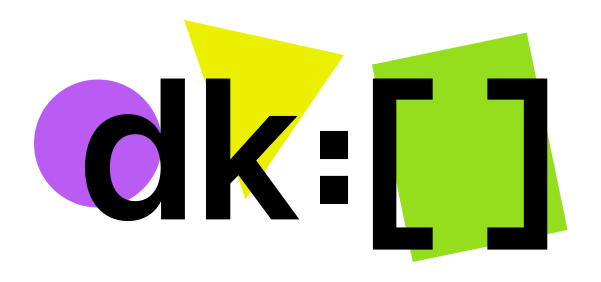

## О проекте

Deklarota - фреймворк для декларативного **моделирования**, **управления** и **вычисления** состояния. (Исследовательский, но рабочий и готовый к использованию проект).

**Предоставляет**

- уникальный способ выражения взаимосвязей для сложных динамичных приложений
  - удобный, **выразительный, с возможностью указания глубоко вложенных зависимостей**, один ко многим - ко многим - ко многим
- систему автоматического реактивного, согласованного выполнения этих взаимосвязей
  - **производительная отслеживание дерева зависимостей**, в особенности вложенных - один ко многим - ко многим - ко многим
- способ сериализации состояния и эффективной передачи его по частям

Deklarota - это фунциональный, реактивный, ООП, MVC, Flux фреймворк 🤯🤯🤯. Нет, но фактически да. Это

- ООП, каким он должен быть в понимании создателя ООП - Алана Кея
- чистые функции без удара по производительности за иммутабельность
- MVC с настоящим разделением M и V
- Flux с глобальным состоянием и без избытка кода
- реактивность без необходимости быть сантехником, соединяющим трубы

## Предназначение

**Предназначен** для написания сложных, динамичных, **производительных** фронтенд приложений, синхронизации состояния.

**Подходит** для разработчиков, использующих декларативный подход.

Средства выражения (декларирования) ***позволяют анализировать*** все взаимосвязи состояния между собой, а также взаимосвязи состояния и внешнего мира ***без запуска самого приложения***. Вся цепочка изменений может быть предсказана без выполнения. С целью:

- Автоматизации реактивного согласования, актуализации состояния с поддержкой "ленивости"

- Упрощения написания корректно работающего кода (согласованного состояния сложносвязанных ресурсов). Не пишете код, который согласует состояние - не совершаете в нем ошибок

- Создания более продвинутых инструментов разработки (упрощение рефакторинга бизнес логики, анализ связи полей и моделей между собой, анализ flow данных прямо во время выполнения)
- Автоматизации параллельных вычислений. Решения соответсвующих проблем, инвалидации кеша (планировщик, исключающий конфликтующие изменения)

Deklarota берет на себя реактивную актуализацию всех частей на основе анализа взаимосвязей, поддерживая согласованность данных и освобождая разработчиков от необходимости написания этих частей кода. В результате позволяет разработчикам сосредоточится на «бизнез логике», на модели данных.

В результате написание приложения становиться описанием структуры ваших данных, а, не написанием последовательности шагов

## Части Deklarota и преимущество для рендеринга

Deklarota - состоит из двух основных частей

	- dsl для описания ваимосвязей, структуры (язык разметки связей)
	- система реактивной актуализации взаимосвязей (runtime)

На выход runtime дает:

- snapshot текущего состояния
- конкретные изменения, происходящие в глобальном состоянии по кусочкам

Используя эти данные рендерингу не требуется строить virtual dom, т.к. на вход ему сразу приходит diff

## Рекомендации и особенности написания кода

 - наибольшей корректности и производительности можно достичь при большей декомпозиции логических частей, дроблении смысловых участков, на мелкие части, что
    - исключает ошибки логики (возникающие при склеивании разных по смыслу вещей в одно целое с целью каких либо опцимизации)
    - активнее задействует систему мемоизации (кеширования) вычислений deklarota

Одно из наиболее удачных примнений для deklarota это приложения с необходимостью использования background / render разделение.

	- инкриментальной прозрачной синхронизации состояния для background/ render архитектур, например:
		- electron main / render processes
	  - chrome extension background / popup page,
	  - web worker / usual page

Автор логотипа - https://twitter.com/nikitonsky

Copyright (c) 2009—2019 Gleb Arestov
Licensed under the [MIT](http://www.opensource.org/licenses/mit-license.php) license.
